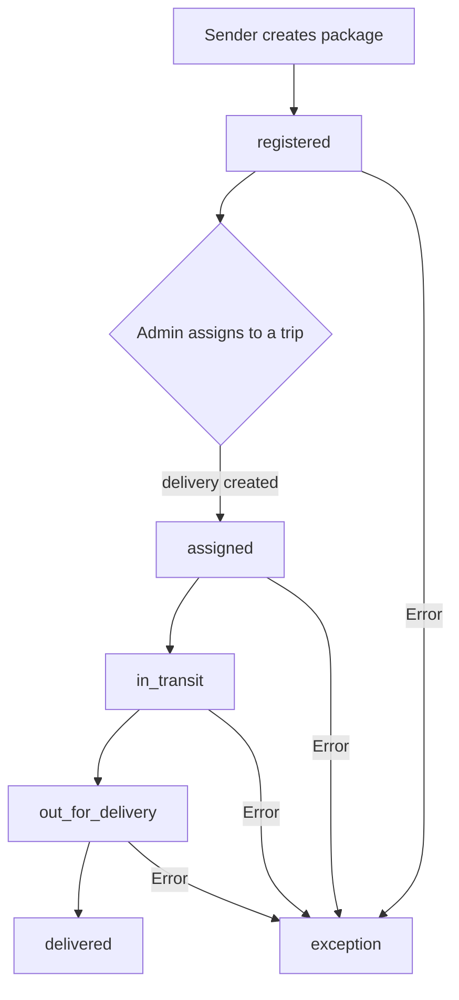
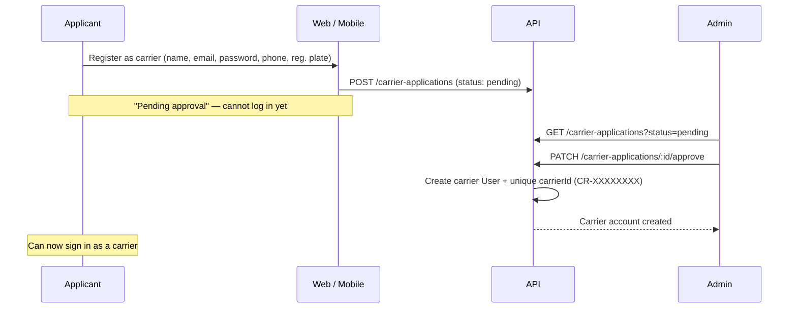
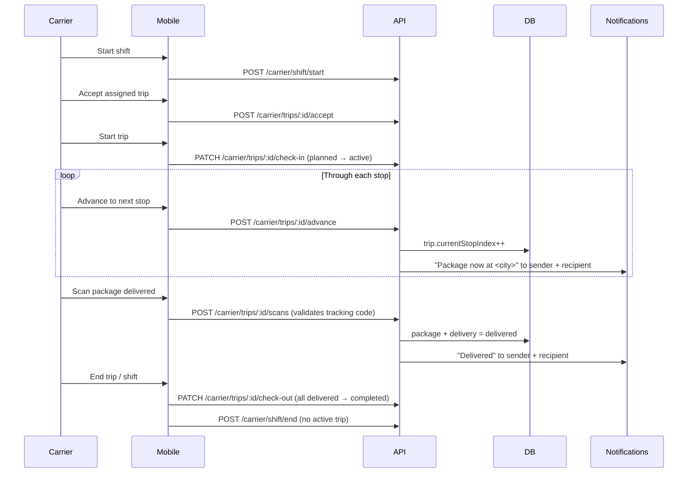
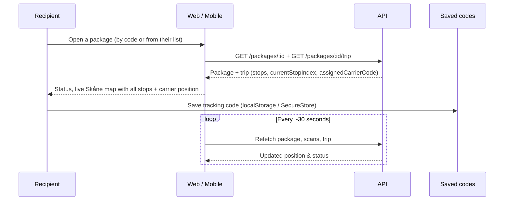
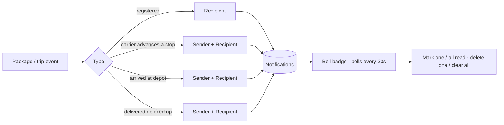

# PacketFlow

A delivery platform for Skåne. Senders create shipments, admins organise carriers into trips, carriers run those trips and scan packages as delivered, and recipients track everything on a live map — all in real time, on **web and mobile**.

---

## Monorepo layout

```
packetFlowTest/
├── apps/
│   ├── backend/        Express + Mongoose API (TypeScript)
│   ├── web/            React + Vite web app (admin, sender, recipient, carrier)
│   └── mobile/         Expo / React Native app (sender, recipient, carrier)
├── packages/
│   ├── backend-client/ Typed HTTP client shared by web and mobile
│   └── types/          Shared domain types + Skåne constants + plate validation
```

The web app serves all four roles (incl. the admin console). The mobile app is for **sender, recipient, and carrier** — admin stays web-only. Both apps talk to the same backend through `@packetflow/backend-client`.

---

## Roles

| Role | Where | Can do |
|------|-------|--------|
| **Sender** | web + mobile | Create packages, view their shipments & package history, track, edit profile / delete account |
| **Recipient** | web + mobile | Track by code, save packages, view packages addressed to them, get live notifications, edit profile / delete account |
| **Carrier** | web + mobile | Run a shift, accept/start trips, advance through stops, scan packages delivered, view session history, edit profile / delete account |
| **Admin** | web only | Manage packages, trips, carriers, users, carrier applications, webhooks |

Carriers don't self-register: they submit a **carrier application** that an admin approves. On approval a carrier account is created and assigned a **unique public carrier ID** (e.g. `CR-7QF3K9PA`). Carriers are shown by that ID across the app (next to the name in the admin console; ID-only on public tracking).

---

## Package lifecycle



---

## Carrier application & approval



Vehicle is captured as a **Swedish registration plate** and validated (`ABC 12D` — 3 letters / 2 digits / 1 letter, or `ABC 123` — 3 letters / 3 digits) on both client and server.

---

## Carrier shift, trip & scans



The trip's `currentStopIndex` over its journey `[startCity, ...stops, endCity]` is what drives the **live map** for senders and recipients.

---

## Recipient live tracking



---

## Notifications



---

## API reference

Base path: `/api/v1`.

### Auth & self-service
| Method | Path | Auth | Description |
|--------|------|------|-------------|
| `POST` | `/auth/register` | Public | Create account (sender / recipient only) |
| `POST` | `/auth/login` | Public | Get JWT |
| `GET` | `/auth/me` | Bearer | Verify token |
| `PATCH` | `/auth/me` | Bearer | Update own profile (name) |
| `DELETE` | `/auth/me` | Bearer | Delete own account |

### Packages
| Method | Path | Auth | Description |
|--------|------|------|-------------|
| `POST` | `/packages` | Optional | Create shipment |
| `GET` | `/packages` | Bearer | List (role-filtered) |
| `GET` | `/packages/:id` | Bearer | Single package |
| `GET` | `/packages/:id/trip` | Bearer | Trip for a package (stops, current position, carrier id) |
| `PATCH` | `/packages/:id` | Admin / Carrier | Update |
| `DELETE` | `/packages/:id` | Admin | Delete |
| `POST` | `/packages/:id/arrive` | Carrier | Mark at drop-off |
| `POST` | `/packages/:id/pickup` | Carrier | Mark delivered |

### Trips
| Method | Path | Auth | Description |
|--------|------|------|-------------|
| `GET` | `/trips` | Bearer | All trips |
| `GET` | `/trips/my` | Carrier | Own trips |
| `POST` | `/trips` | Admin | Create trip (name auto-suggested from cities) |
| `PATCH` | `/trips/:id` | Admin | Update / assign carrier |
| `PATCH` | `/trips/:id/status` | Carrier | Advance status |
| `DELETE` | `/trips/:id` | Admin | Delete trip |
| `GET` | `/trips/:id/deliveries` | Bearer | Trip deliveries |
| `PATCH` | `/trips/:id/deliveries` | Admin | Bulk-assign deliveries |

### Carrier (role: carrier)
| Method | Path | Description |
|--------|------|-------------|
| `GET` | `/carrier/me` | Own account + carrier profile (incl. carrier id) |
| `GET` | `/carrier/history` | Session history (trips + delivery counts) |
| `PATCH` | `/carrier/profile` | Update name / phone / vehicle plate |
| `DELETE` | `/carrier/account` | Delete own account |
| `GET` | `/carrier/shift` | Shift state + assigned trip |
| `POST` | `/carrier/shift/start` · `/carrier/shift/end` | Clock in / out |
| `GET` | `/carrier/trip` | Current planned/active trip + deliveries |
| `POST` | `/carrier/trips/:id/accept` | Accept assigned trip |
| `POST` | `/carrier/trips/:id/advance` | Move to next stop (notifies) |
| `GET` | `/carrier/trips/:id/packages` | Packages on a trip |
| `PATCH` | `/carrier/trips/:id/check-in` · `/check-out` | Start / end trip |
| `POST` | `/carrier/trips/:id/scans` | Scan a package delivered |

### Carrier applications
| Method | Path | Auth | Description |
|--------|------|------|-------------|
| `POST` | `/carrier-applications` | Public | Submit application |
| `GET` | `/carrier-applications` | Admin | List applications |
| `PATCH` | `/carrier-applications/:id/approve` | Admin | Approve → create carrier + id |
| `PATCH` | `/carrier-applications/:id/reject` | Admin | Reject |

### Deliveries, users, notifications
| Method | Path | Auth | Description |
|--------|------|------|-------------|
| `GET` `POST` `PATCH` `DELETE` | `/deliveries` … | Admin / Carrier | Manage deliveries |
| `GET` | `/users` | Admin | User directory (carriers include carrier id) |
| `POST` | `/users` | Admin | Create user |
| `DELETE` | `/users/:id` | Admin | Delete user |
| `GET` | `/notifications` | Bearer | My notifications |
| `PATCH` | `/notifications/read-all` · `/:id/read` | Bearer | Mark all / one read |
| `DELETE` | `/notifications/:id` · `/notifications` | Bearer | Delete one / clear all |

---

## Running locally

### Ports at a glance

| Service | URL |
|---------|-----|
| Backend API | `http://localhost:3001` (base path `/api/v1`) |
| Web app (Vite) | `http://localhost:3002` |
| Mobile (Expo dev server / web) | `http://localhost:3003` |

The backend automatically allows the common local-dev browser origins (`3002`, `3003`, `5173`, `8080`, `8081`, `19006`) outside production, so the web app and Expo web aren't blocked by CORS.

### 1. Backend (port 3001)

Create `apps/backend/.env` (see `apps/backend/.env.example`):

```env
PORT=3001
MONGO_URI=mongodb://localhost:27017/packetflow
JWT_SECRET=replace-with-a-long-random-secret
JWT_EXPIRES_IN=7d
# Extra browser origins allowed by CORS (the local dev ports above are added automatically).
CORS_ORIGINS=http://localhost:3002
```

```bash
npm install                 # install all workspaces
npm run dev:api             # start the backend (tsx watch) on :3001
npm run create-admin --workspace=@packetflow/backend   # optional: bootstrap an admin
```

### 2. Web app (port 3002)

```bash
npm run dev:web             # Vite dev server on http://localhost:3002
```

### 3. Mobile app (Expo, port 3003)

```bash
npm run -w @packetflow/mobile start   # Expo dev server on http://localhost:3003
# or, from apps/mobile:
cd apps/mobile && npm run web          # opens Expo web on http://localhost:3003
```

The mobile app talks to the **backend** at `http://localhost:3001/api/v1`, pinned via `expo.extra.apiUrl` in `apps/mobile/app.json`. For a physical device, change that value (or run the backend on your LAN IP). Port 3003 is just where the Expo dev server / web UI is served.


### Tests

```bash
npm test                    # backend (Vitest)
```

---

## Tech stack

- **Backend** — Express, Mongoose/MongoDB, Zod validation, JWT auth, role-based access control, webhook dispatch.
- **Web** — React, Vite, React Router, TanStack Query, Tailwind, Radix UI; light/dark theme.
- **Mobile** — Expo Router, React Native (+ react-native-web), react-native-svg, TanStack Query; shared light/dark theme and an in-app dialog system.
- **Shared** — `@packetflow/types` (domain types, Skåne cities, plate validation) and `@packetflow/backend-client` (typed API client) used by both front-ends.
```
