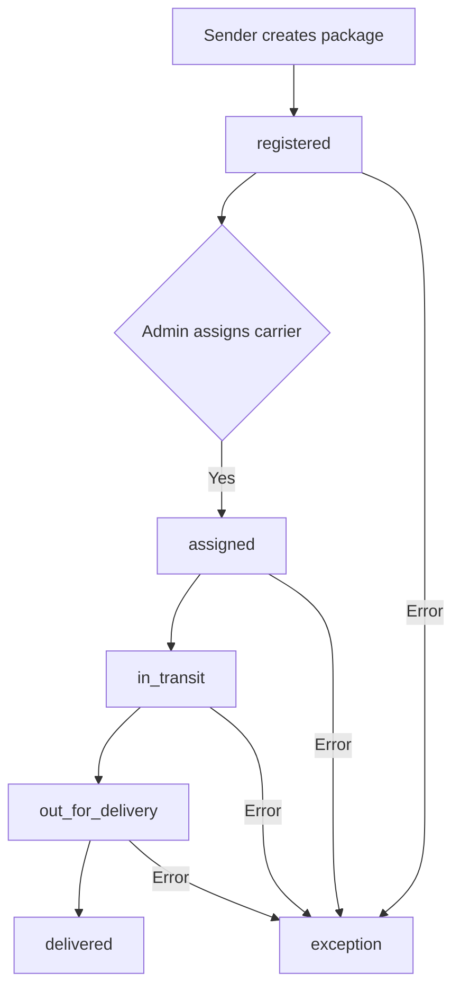
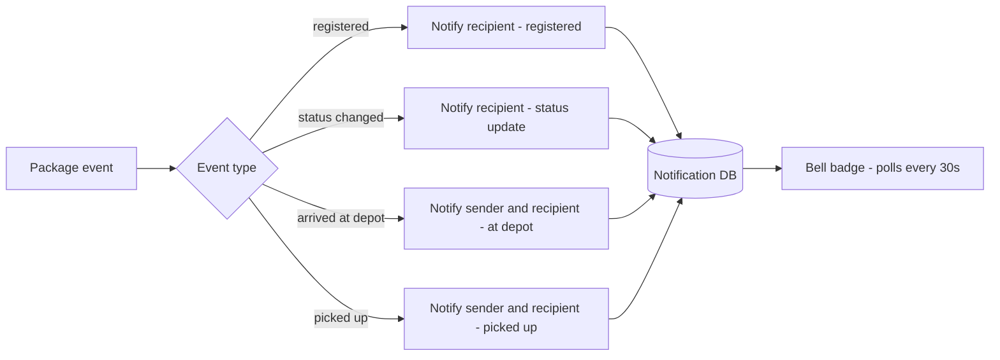
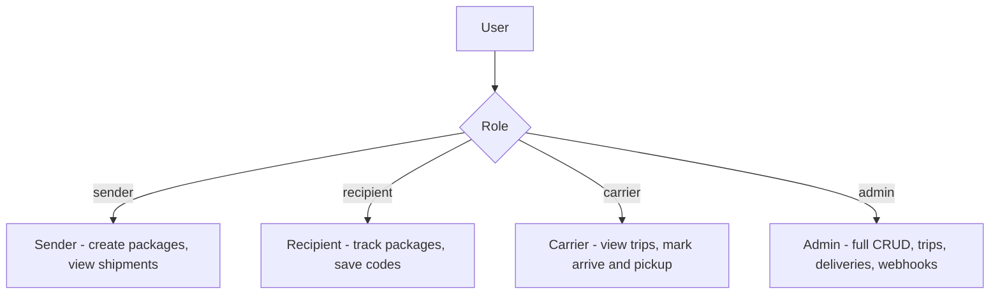
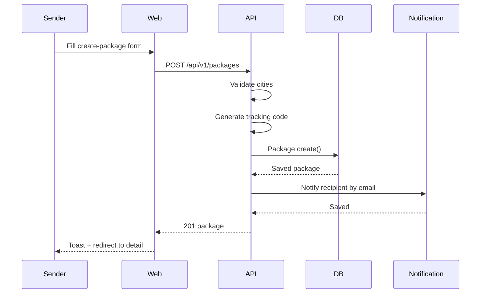
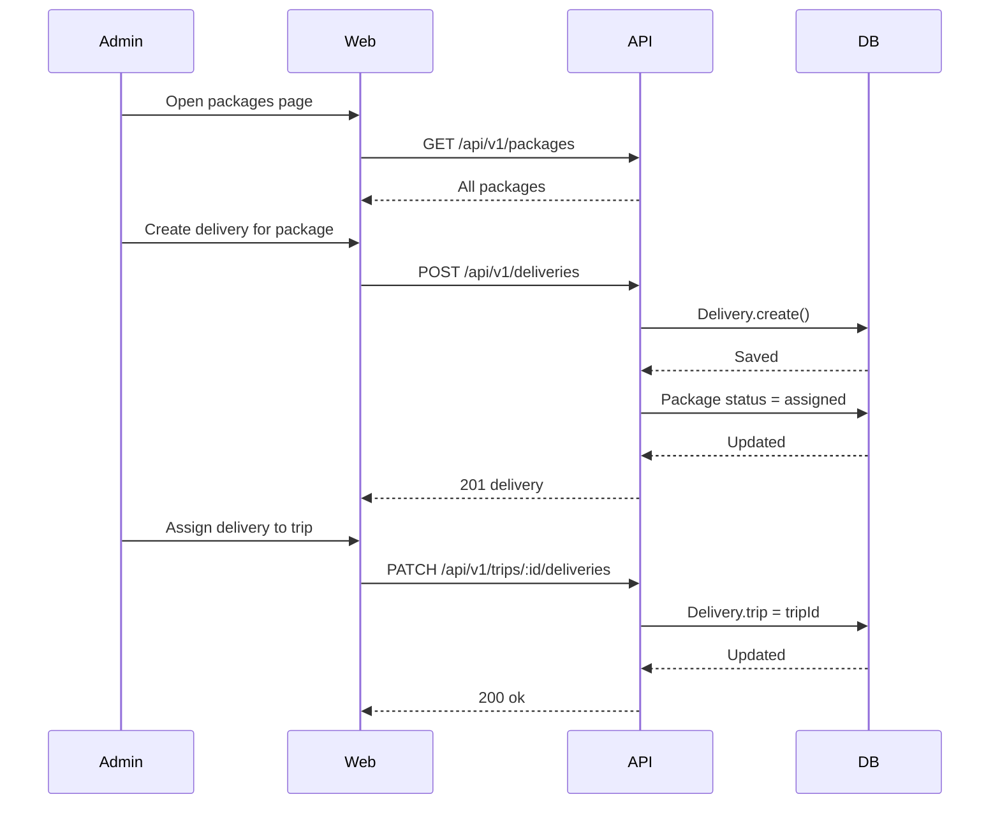
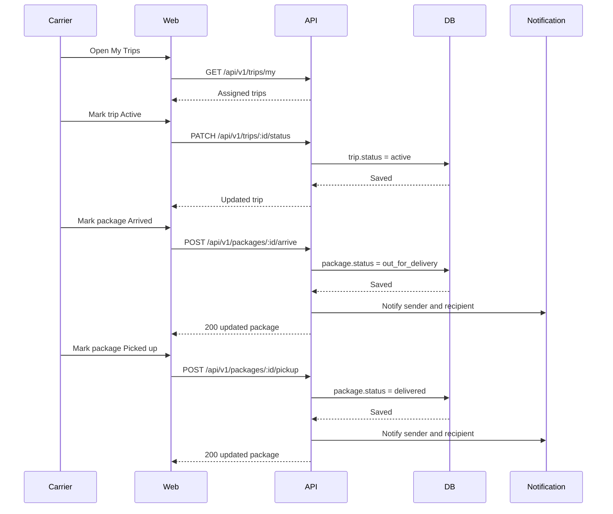
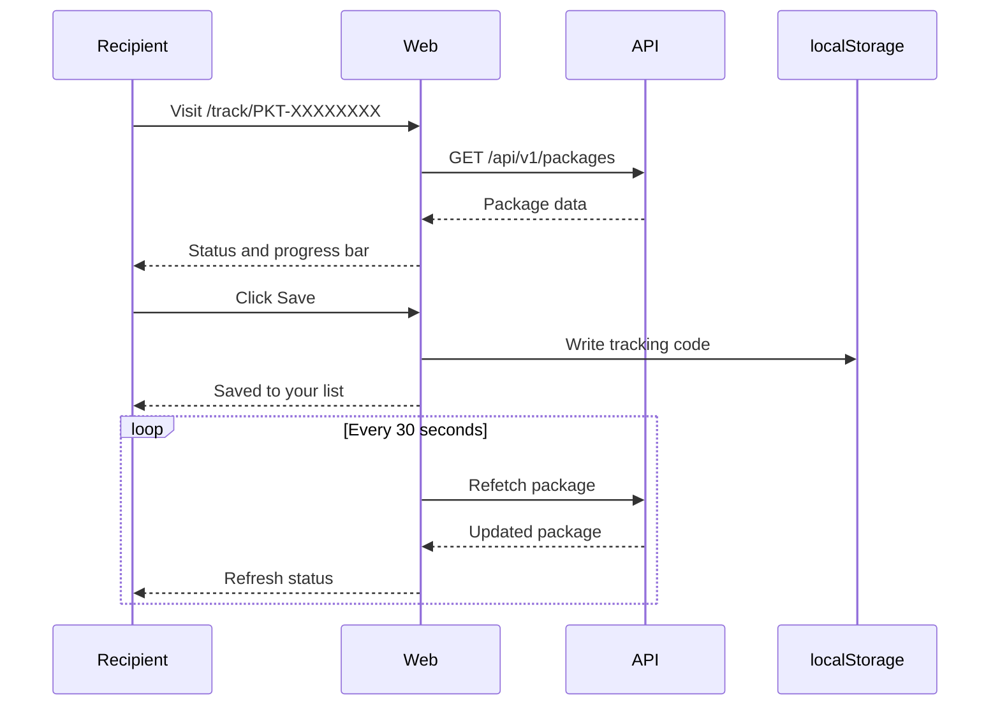
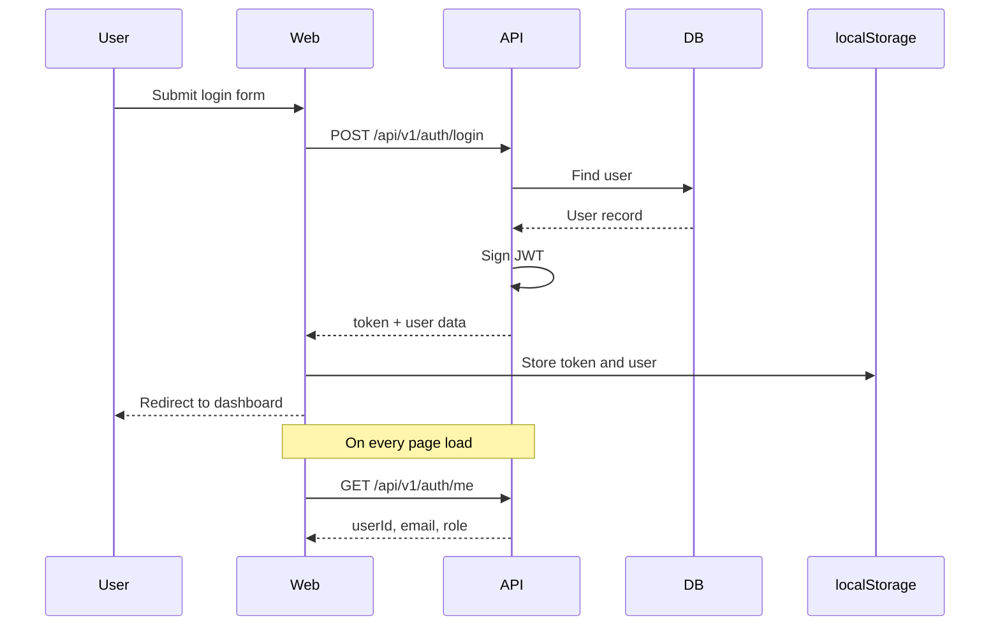

# PacketFlow

A delivery platform for Skåne. Senders create shipments, admins organise carriers into trips, carriers drive packages to drop-off depots, and recipients collect them — all tracked in real time.

---

## Monorepo layout

```
packetFlowTest/
├── apps/
│   ├── api/          Express + Mongoose backend
│   └── web/          React + Vite frontend
├── packages/
│   ├── api-client/   Typed HTTP client shared by web and mobile
│   └── types/        Shared domain types and Skåne city constants
```

---

## Package lifecycle



---

## Notification flow



---

## Role access



---

## Sender creates a package



---

## Admin assigns a delivery



---

## Carrier advances a trip



---

## Recipient tracks a package



---

## Auth flow



---

## API reference

| Method | Path | Auth | Description |
|--------|------|------|-------------|
| `POST` | `/auth/register` | Public | Create account |
| `POST` | `/auth/login` | Public | Get JWT |
| `GET` | `/auth/me` | Bearer | Verify token |
| `POST` | `/packages` | Optional | Create shipment |
| `GET` | `/packages` | Bearer | List (role-filtered) |
| `GET` | `/packages/:id` | Bearer | Single package |
| `PATCH` | `/packages/:id` | Admin / Carrier | Update |
| `DELETE` | `/packages/:id` | Admin | Delete |
| `POST` | `/packages/:id/arrive` | Carrier | Mark at drop-off |
| `POST` | `/packages/:id/pickup` | Carrier | Mark delivered |
| `GET` | `/trips` | Bearer | All trips |
| `GET` | `/trips/my` | Carrier | Own trips |
| `POST` | `/trips` | Admin | Create trip |
| `PATCH` | `/trips/:id` | Admin | Update trip |
| `PATCH` | `/trips/:id/status` | Carrier | Advance status |
| `DELETE` | `/trips/:id` | Admin | Delete trip |
| `GET` | `/trips/:id/deliveries` | Bearer | Trip deliveries |
| `PATCH` | `/trips/:id/deliveries` | Admin | Bulk-assign deliveries |
| `GET` | `/deliveries` | Admin / Carrier | All deliveries |
| `POST` | `/deliveries` | Admin | Create delivery |
| `PATCH` | `/deliveries/:id` | Admin | Update delivery |
| `DELETE` | `/deliveries/:id` | Admin | Delete delivery |
| `GET` | `/users` | Admin | User directory |
| `GET` | `/notifications` | Bearer | My notifications |
| `PATCH` | `/notifications/read-all` | Bearer | Mark all read |
| `PATCH` | `/notifications/:id/read` | Bearer | Mark one read |

---

## Running locally

```bash
# Install all workspaces
npm install

# Start backend (port 3001)
npm run dev --workspace=apps/api

# Start frontend (port 8080)
npm run dev --workspace=apps/web

# Run API tests
npm test --workspace=apps/api
```
